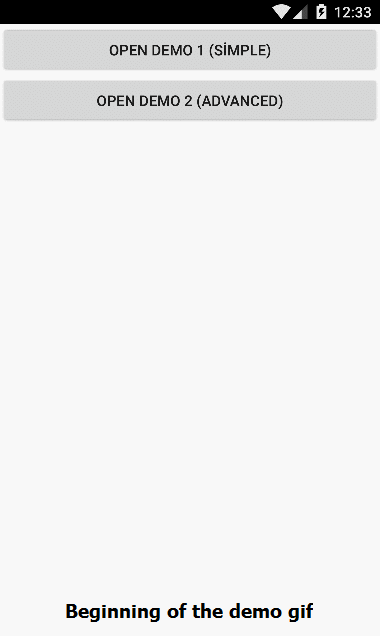

#SectionedRecyclerViewAdapter

**SectionedRecyclerViewAdapter** is offers a simple way to create **RecyclerView** adapters for Xamarin Android.

##Under the hood
This library only has a class, inherits from Android's **RecyclerView.Adapter**.

These original methods are hidden:
```C#
public override void OnBindViewHolder(RecyclerView.ViewHolder holder, int position)

public override RecyclerView.ViewHolder OnCreateViewHolder(ViewGroup parent, int viewType)
```

Instead of overriding original **RecyclerView.Adapter** methods, you have to override these new (much simpler) methods, similar to iOS's **TableView DataSource**:

```C#
///How many sections do you have?
public virtual int NumbersOfSections();

///How many items do you have in this specified section?
public abstract int RowsInSection(int section);

///How to inflate Item Views?
public abstract RecyclerView.ViewHolder OnCreateItemViewHolder(ViewGroup parent);

///How to populate Item Views?
public abstract void OnBindItemViewHolder(RecyclerView.ViewHolder holder, IndexPath indexPath);

///How to inflate Section Views? (optional)
public virtual RecyclerView.ViewHolder OnCreateSectionViewHolder(ViewGroup parent);

///How to populate Section Views? (optional)
public virtual void OnBindSectionViewHolder(RecyclerView.ViewHolder holder, int section);

///How to get item at this indexPath
public abstract T GetItem(IndexPath indexPath);
```

##Why use this library? How it makes things easy?

Because, it's addresses item positions in custom `IndexPath` structure. It's easy to know, which element in which section?
```C#
public class IndexPath
{
    public int OriginalPosition { get; set; }
    public int SectionIndex { get; set; }
    public int? ItemIndex { get; set; }
}
```

##How can i use?

In the solution, you can find a demo project. It has two examples fulled with comments.
First one is simple example, other one is more advanced.

I think this demo project enough for understanding the logic of this library.

